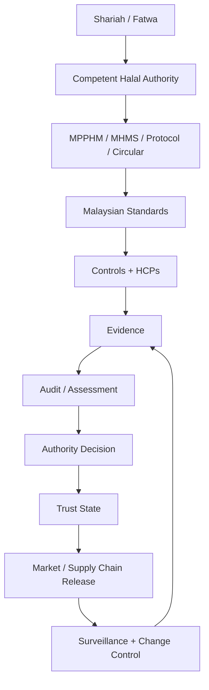
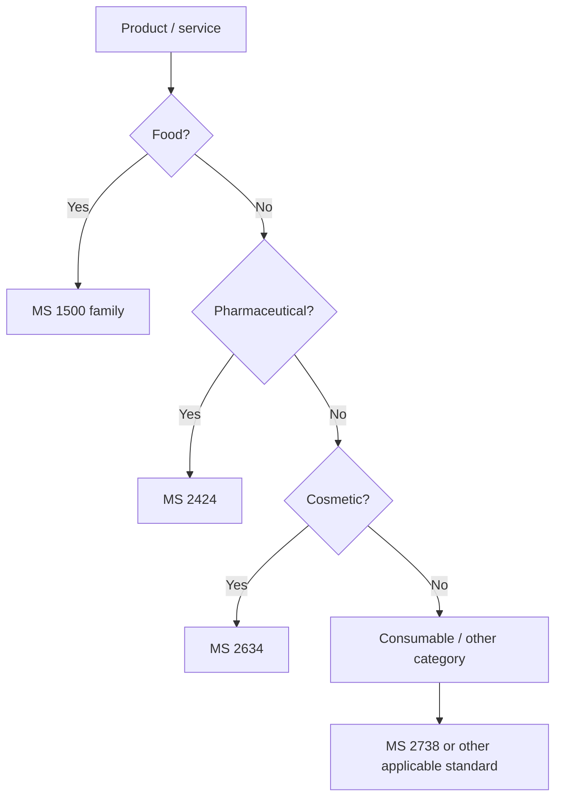

# 01 - MASTER STANDARDS STACK

## 1. Executive architecture

The supplied standards and training materials support a layered compliance-and-trust system, not a single flat standard. IQ300 therefore uses:

**Shariah / fatwa -> competent authority -> certification operating layer -> technical standards -> controls / Halal Control Points -> evidence -> human assessment -> authority decision -> trust state -> physical and digital release -> surveillance / change control.**

## 2. Master catalogue represented by the supplied compendia

| Family | Instrument | Primary IQ300 role |
|---|---|---|
| Food | MS 1500:2019 | halal food manufacturing and handling baseline |
| Supply chain | MS 2400-1:2019 | transportation |
| Supply chain | MS 2400-2:2019 | warehousing |
| Supply chain | MS 2400-3:2019 | retailing |
| Pharmaceuticals | MS 2424:2019 | halal pharmaceutical quality/Halal Management System |
| Cosmetics | MS 2634:2019 | halal cosmetics and material provenance |
| Consumable goods | MS 2738:2023 | halal consumable goods outside primary sector scopes |
| Animal materials | MS 2803:2025 | animal bone, skin and hair |
| Terminology | MS 2393:2023 | canonical Islamic and halal vocabulary |
| Analytical evidence | MS 2627 family / MS 2627-2:2025 | qualitative PCR / qPCR evidence for specified matrices |
| Organization | MS 1900:2025 | Shariah-based quality management |
| Professional competence | MS 2691:2021 | halal professional competency |
| Supporting | MS 2610:2015 | Muslim-friendly hospitality |

The supplied compendia also preserve historical/replaced relationships, including older MS 1500, MS 2424 and MS 2200 family editions. IQ300 must store supersession rather than erase historical provenance.

## 3. Authority and instrument boundaries

### JSM / standards layer
The supplied materials identify the Department of Standards Malaysia and the relevant standards committee architecture as the technical-standard development/publication layer.

### JAKIM / JAIN / competent Halal authority layer
The supplied materials place application assessment, audit, panel/authority decisions, certification and surveillance functions at the competent authority level as applicable.

### Certification operating layer
MPPHM, MHMS, current Protocols and circulars provide operational rules that sit around the standards. The detailed slaughter/stunning rules are not to be reconstructed from historic MS 1500 annex values when the current operative Protocol/authority instrument controls them.

### Other regulators
NPRA and other sector regulators impose separate legal prerequisites. A halal engine must model those prerequisites as distinct regulatory gates rather than silently treating them as halal evidence.

## 4. Master control object

Every applicable requirement becomes a structured object:

`RequirementID, authority, instrument, edition, confirmation, effective date, clause, requirement, applicability, risk, control objective, control, HCP, physical object, evidence, test, actor, verifier, authority gate, event, failure state, corrective action, re-verification, trust-state effect, source, verification status.`

## 5. Product-scope routing

Supply-chain requirements may then be overlaid by node: transportation, warehouse and retail.

## 6. Master supply-chain stack

`Manufacturer -> transport -> warehouse -> transport -> retail -> consumer`, with each node maintaining its own applicable control scope and linked credential/status. A product certificate does not automatically make an independent carrier, warehouse or retailer certified.

## 7. Cross-cutting control classes

### Material provenance
Source, supplier, manufacturer, species/origin, processing route, specification, certificate and status.

### Physical segregation
Dedicated or controlled areas, equipment, utensils, vehicles, containers, storage zones and display arrangements where required.

### Halal risk management
Identify potential contaminants/precursors, rate risk, define control measures, determine HCPs, monitor, correct and verify.

### Traceability
Maintain linkage from material -> batch/lot -> pallet/case -> container -> custody event -> warehouse -> retail -> market.

### Human competence
People are trust objects. Roles, training, competence and authorization must be tied to the HCPs and activities they perform.

### Evidence integrity
Evidence is attributable, time-stamped, scoped, versioned and linked to the physical object and requirement.

### Authority decision
An official authority decision is distinct from technical compliance evidence.

## 8. Master trust graph

```mermaid
flowchart LR
    AUTH[Authority] --> INST[Standard / Protocol / Fatwa / Circular]
    INST --> REQ[Requirement]
    REQ --> CTRL[Control]
    CTRL --> HCP[HCP]
    HCP --> OBJ[Physical Object]
    OBJ --> EV[Evidence]
    EV --> AUD[Assessment]
    AUD --> FIND[Finding / NCR]
    FIND --> CAR[Corrective Action]
    CAR --> RV[Re-verification]
    RV --> DEC[Authority Decision]
    DEC --> TS[Trust State]
```

## 9. Trust states

Recommended platform states:

`PENDING -> EVIDENCE-COMPLETE -> ASSESSED -> VERIFIED`

Exception states:

`HOLD`, `CORRECTIVE-ACTION`, `RE-VERIFICATION`, `QUARANTINED`, `DISPUTED`.

Terminal/credential states:

`EXPIRED`, `REVOKED`, `RECALLED`.

`VERIFIED` is a platform assessment state. It must not be presented as a legal/official halal certificate unless linked to a valid authority credential.

## 10. Non-negotiable IQ300 rules

- Laboratory evidence is evidence, not certification.
- A "not detected" PCR/qPCR result does not establish halal status by itself.
- Sertu is not ordinary sanitation and cannot be replaced by a laboratory-negative result.
- Historical/withdrawn standard clauses must not silently override the current operative standard/protocol.
- AI may advise and detect anomalies; it cannot issue or override an authority decision.
- A QR code, blockchain entry or internal database record is a representation of trust, not the authority credential itself.
- All production rules require a versioned source reference.

## 11. 2026-09-18 attached-source ingestion

[PROPOSAL: closes primary-source depth gap - canonical path point: Standard / Instrument]

The 2026-09-18 attachment set adds readable primary supplied copies of MS 1500:2019 (BM), MS 2400-1:2019, MS 2400-2:2019, MS 2400-3:2019, MS 2610:2015, MS 2683:2017 and MS 2691:2021, plus two secondary synthesis PDFs. The frozen `verified-2026-09-17/` package is unchanged.

For the next controlled snapshot, MS 1500:2019, MS 2610:2015 and MS 2691:2021 are candidates for promotion from public-structure depth to primary-supplied-standard/source-held depth after clause-object reconciliation. MS 2683:2017 is registered as a supplemental Kelulut (stingless bee) honey specification and is **not** added to the 17-standard Malaysian halal operating set.

See `16_ATTACHED_PDF_SOURCE_INGESTION_2026-09-18.md` and `attached-source-ingestion-registry-2026-09-18.json`.
