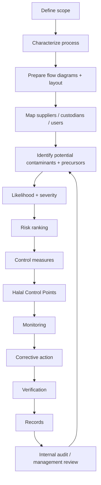
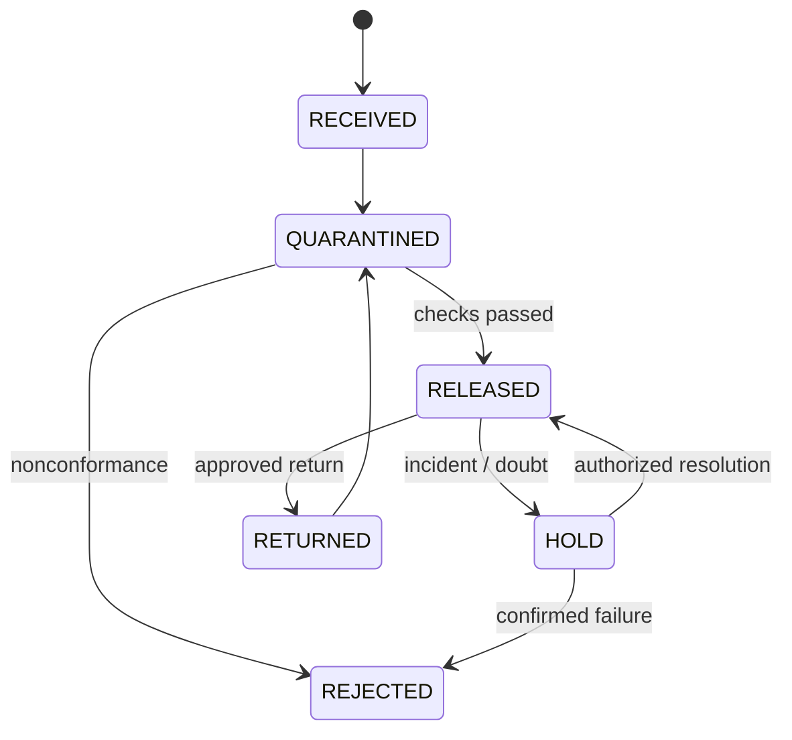
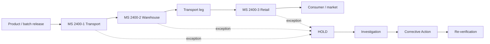

# 02 - MS 2400 FULL CLAUSE / CONTROL MAP

## A. Common MS 2400 architecture

The supplied MS 2400-1, -2 and -3 PDFs share a management-system architecture:

1. Scope
2. Normative references
3. Terms and definitions
4. Requirements
5. Preliminary steps to enable risk management process
6. Operations of the Halal Risk Management Plan
7. General requirements for premises, infrastructure, facilities and personnel
8. Maintenance of the halal supply chain

Common annex families cover: HCP analysis worksheet; likelihood/severity/risk ranking; Halal Risk Management Summary; sertu method. Retailing additionally contains a typical retail process annex.

### Common management-control sequence

## B. MS 2400-1:2019 - Transportation

### 4 Requirements
- 4.1 Requirements related to Shariah
- 4.2 Management responsibility
  - 4.2.1 Halal policy
  - 4.2.2 Organisation
    - responsibility and authority
    - internal halal committee
- 4.3 Halal Management System requirements
  - 4.3.1 General
  - 4.3.2 Procedures of the Halal Management System
  - 4.3.3 Validation
  - 4.3.4 Halal Risk Management Plan
    - identification of potential contaminants/precursors
    - risk evaluation/ranking
    - control measures
    - determination of HCPs
    - monitoring systems
    - corrective actions
    - verification procedures
    - documentation and record control
- 4.4 Halal Risk Management Plan Summary
- 4.5 Information and communication system

### 5 Preliminary steps
- 5.1 Process characteristics - inbound/outbound transport services are described and kept current.
- 5.2 Process flow diagrams - complete, clear, sufficiently detailed and verified on site.
- 5.3 Layout plan - process sites, storage and relevant personnel facilities.
- 5.4 Chain of custody
  - consignment verification
  - next-custodian compliance validation
  - stakeholder/user identification
  - goods in transit
  - preparation and dispatch
  - loss/damage
  - documentation
  - agents/outsourcing parties

### 6 Operations
- 6.1 Transportation chain services and related activities
- 6.2 Records
- 6.3 Non-conformity
  - contaminated/affected product
  - doubtful product
  - corrective action
- 6.4 Isolation and notification
  - complete/timely isolation
  - documented isolation procedure
  - degree of detail matched to risk
  - secured/controlled isolated material
  - cause/extent/result reporting
  - effectiveness verification
- 6.5 Communication
- 6.6 Traceability
- 6.7 Monitoring and measuring equipment
  - control/calibration
  - basis where no standard exists
  - monitoring/validation/verification methods
  - calibration/verification records
- 6.8 Emergency preparedness
- 6.9 Outsourced service providers/subcontractors
  - evaluation/selection
  - control requirements
  - re-evaluation

### 7 Physical environment / people
- 7.1 Transport location
- 7.2 Premises design/layout
- 7.3 Facilities, equipment and materials
- 7.4 Personnel hygiene, health status and cleanliness
- 7.5 Environment, perimeter and grounds
- 7.6 Equipment maintenance
- 7.7 Cleaning and sanitation
- 7.8 Sertu
  - performed when applicable contamination occurs
  - supervision/verification by competent Halal authority as required
  - records
  - method linked to the applicable Shariah/Annex source
- 7.9 Drainage and waste disposal
- 7.10 Training of personnel
- 7.11 Contamination control: physical, chemical, biological and pest control

### 8 Maintenance
- 8.1 Internal halal audit
- 8.2 Management review
- 8.3 Complaints and feedback
- 8.4 Responsiveness to change; changes are documented and controlled through halal governance

### Transportation HCP set

`pre-loading vehicle/container condition; previous-load risk where relevant; cleaning; segregation; cargo identity; loading; seal; custody handoff; transit conditions; temperature for applicable goods; tamper/opening; loss/damage; proof of delivery; return/backhaul; outsourced carrier status.`

## C. MS 2400-2:2019 - Warehousing

The warehousing standard follows the same clauses 4-8, but the operating context changes from movement to controlled custody/inventory.

### Key preliminary controls

- inbound material/product/process characterization;
- complete warehouse process flow;
- storage and personnel layout;
- chain-of-custody validation;
- identification of end-user/next actor;
- receiving and stock controls;
- quarantine/release/rejected/returned status;
- segregation and storage condition;
- handling and dispatch;
- outsourced warehouse controls.

### Warehouse operations

Clause 6 addresses warehouse operations, records, nonconformity, doubtful products, corrective action, communication, traceability, monitoring equipment, emergency preparedness and outsourced providers.

### Status machine

### Warehouse HCP set

`receiving/seal; document identity; packaging integrity; batch/lot; quarantine/release; storage segregation; pallet/material handling equipment; spill/damage; returns; pest/hygiene; temperature/condition; cleaning; picking; dispatch; outsourced warehouse.`

## D. MS 2400-3:2019 - Retailing

### 4-5 architecture

The same management/HCP architecture is applied to receiving, retail storage, preparation, display, merchandising, sale/serving and related retail activities.

### 6 Operations
- 6.1 Retailing activities
- 6.2 Records to be maintained - supplier selection/approved suppliers/order/service records and inventory records.
- 6.3 Non-conformity - contaminated/affected and doubtful products; corrective action.
- 6.4 Withdrawals/recalls - timely identification, secure holding, cause/extent/result, communication and effectiveness verification.
- 6.5 Communication
- 6.6 Traceability
- 6.7 Monitoring/measuring equipment
- 6.8 Emergency preparedness
- 6.9 Outsourced service providers/subcontractors

### 7 Retail physical environment
- 7.1 Retail location
- 7.2 Premises design/layout
- 7.3 Equipment
- 7.4 Facilities: water, drainage/waste, cleaning/sanitation, air/ventilation, lighting, storage
- 7.5 Personnel hygiene/health/cleanliness/conduct/visitors
- 7.6 Environment/perimeter/grounds
- 7.7 Employee, consumer and product flow
  - receiving
  - storage
  - preparation
  - hot/cold processing
  - set-up, assembly and packaging
  - display/merchandising
  - consumer information
- 7.8 Equipment maintenance
- 7.9 Cleaning/sanitation
- 7.10 Sertu, with competent-authority supervision/verification where required
- 7.11 Drainage/waste
- 7.12 Training
- 7.13 Contamination control and pest control

### 8 Maintenance
- internal halal audit;
- management review;
- complaints/feedback;
- responsiveness to changes in the system.

### Retail HCP set

`receiving; label/status verification; storage segregation; preparation; hot/cold handling; food-contact surfaces; utensils; opened packs/tasting samples where relevant; display; self-service controls; employee hygiene; customer-facing information; returns; recall; traceability; outsourced service.`

## E. Cross-standard integration

A chain-of-custody event never exists alone: it must be tied to product identity, custody, condition, responsible actor and evidence.

## F. IQ300 implementation table

| MS 2400 area | Digital object | Minimum evidence |
|---|---|---|
| Scope | ScopeRecord | approved scope/version |
| Process | ProcessRecord | current process description |
| Flow | FlowDiagram | verified flow |
| Layout | LayoutRecord | current layout |
| Risk | RiskRecord | likelihood/severity/rank |
| HCP | HCPRecord | control + monitoring |
| Custody | CustodyEvent | signed handoff + time/location |
| Seal | SealEvent | seal ID + integrity |
| Condition | ConditionRecord | sensor/inspection evidence where applicable |
| Nonconformity | NCR | finding + affected lot |
| Corrective action | CAR | action + owner + due date |
| Verification | Verification | assessor + result |
| Recall/isolation | IsolationRecall | affected scope + effectiveness |
| Outsourcing | ProviderRecord | qualification + re-evaluation |
| Change | ChangeRecord | impact + approval |
