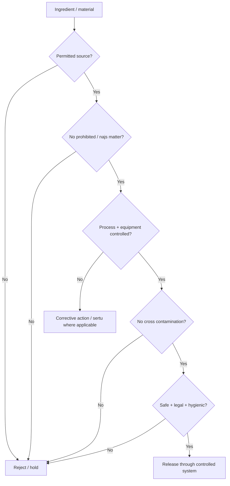
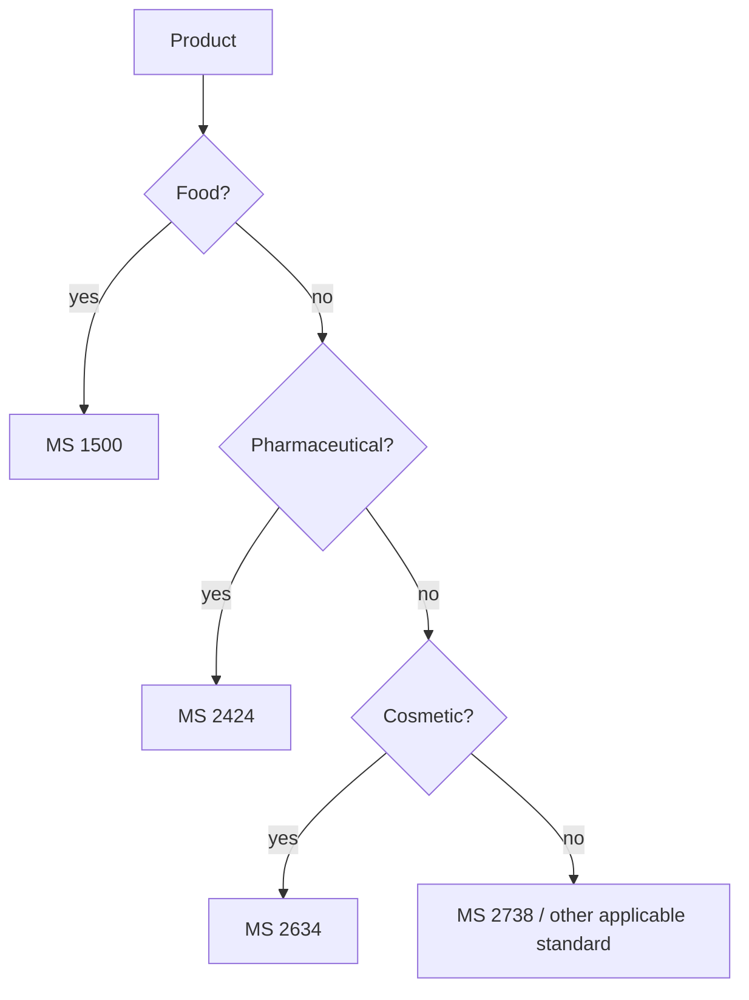

# 03 - SECTOR STANDARDS CONTROL MAP

## MS 1500:2019 - Halal food

### Revision / architecture

The supplied compendia identify MS 1500:2019 as the third revision, replacing MS 1500:2009. The 2019 structure strengthens management responsibility, terminology/normative references and halal-management controls. The detailed slaughtering process clause/annex was removed; current slaughter/stunning requirements therefore belong to the current Malaysian Protocol/JAKIM/fatwa/circular framework.

### Requirement domains

1. Scope - manufacture and handling of halal foods including nutrient supplements.
2. Normative references.
3. Terms and definitions.
4. Requirements:
   - management responsibility;
   - premises and facilities;
   - devices, utensils, machines and processing aids;
   - hygiene, sanitation and food safety;
   - processing;
   - storage;
   - transport;
   - display, sale and/or serving;
   - packaging, labelling and advertising;
   - applicable legal requirements.
5. Compliance - competent-authority inspection/assessment.
6. Halal certificates - authority credential.
7. Certification mark - authority permission/marking rules.
8. Annex - sertu method for najs al-mughallazah.

### Halal-food decision chain

### Material provenance

High-risk material classes identified in the supplied compendia include gelatin, collagen, keratin, animal fats, enzymes, glycerin, emulsifiers, stearates, alcohol/ethanol source and other potentially animal-derived inputs. IQ300 should store source/route evidence for materials where the halal determination depends on origin or processing.

### Slaughter interface

The awareness material explains slaughter as the killing of a live halal animal by a Muslim, with the relevant anatomical severance and intention. Production software must nevertheless use the current operative Malaysian requirements rather than relying on training-slide simplification or obsolete standard annex numbers.

---

## MS 2424:2019 - Halal pharmaceuticals

### Clause architecture represented in the supplied compendia

- 4.1 Quality system
- 4.2 Management responsibility
- 4.3 Halal Management System
- 4.4 Fundamentals
- 4.5 Halal quality control
- 4.6 Personnel
- 4.7 Training
- 4.8 Hygiene
- 4.9 Premises and equipment
- 4.10 Manufacturing/storage controls
- 4.11 Transportation
- 4.12 Quality-control areas
- 4.13 Ancillary operations
- 4.14 Documentation
- 4.15 Manufacturing
- 4.16 Materials
- 4.17 Packaging and labelling
- 4.18 Outsourced processes
- 4.19 Self-inspection
- 4.20 Legal requirements
- 5 Compliance
- 6 Halal certificates
- 7 Certification mark

### Material and route control

The pharmaceutical model is route-aware. For each active/excipient/process aid, IQ300 should capture identity, supplier, manufacturer, origin, source species/material where relevant, manufacturing/synthesis route, processing aids, certificate/specification, analytical evidence and batch use.

### Vaccine Annex B

The supplied compendia identify a new 2019 Annex B for typical Halal Control Points in vaccine manufacturing. Themes include:

- cell/seed accession;
- media, sera, trypsin and peptone;
- adjuvant/carrier protein;
- culture and harvest;
- purification;
- resins, enzymes and buffers;
- formulation and filling lot;
- animal-house/source isolation;
- waste/rejected lots.

The supplied maximum-depth compendium expressly says the official Annex B table should be obtained before freezing every vaccine rule. IQ300 must preserve that as a source-verification gate.

---

## MS 2634:2019 - Halal cosmetics

The supplied compendia identify this as the halal cosmetics standard, confirmed in 2025 in the supplied catalogue and replacing MS 2200-1:2008.

### Critical material classes

Animal fats; collagen; gelatin; keratin; placenta; musk; lanolin; tallow and derivatives; alcohol/ethanol source; glycerin; stearates; emulsifiers; carmine/cochineal; human-derived materials; enzymes/fermentation media; animal-hair brushes/tools.

### Required ingredient dossier

`INCI identity -> function -> supplier -> manufacturer -> source organism/origin -> synthesis/process route -> certificate/specification -> risk -> evidence -> assessment -> product/batch use.`

A chemical identity is not a substitute for halal provenance.

### NPRA/OEM interface

The supplied compendia highlight NPRA notification/GMP prerequisites and OEM/contract-manufacturer controls. IQ300 must separate legal regulatory prerequisites from halal certification decisions while linking both in the product compliance record.

### qPCR interface

MS 2627-2:2025 is represented as a real-time PCR method for cosmetics. A food PCR method should not automatically be treated as suitable for cosmetic matrices without matrix-specific validation.

---

## MS 2738:2023 - Halal consumable goods

Use after product-scope classification. The standard is intended for consumable goods outside the core sector standards, subject to the exact applicable boundary.

---

## MS 2803:2025 - Animal bone, skin and hair

The supplied compendia identify MS 2803:2025 as replacing MS 2200-2:2013.

### Provenance controls

- species;
- material/tissue type;
- source origin;
- slaughter/source-status evidence where relevant;
- processing route;
- manufacturer/supplier;
- segregation/custody;
- storage;
- documentation and traceability.

### Animal-material record

`MaterialID, species, tissue/material, source country, source facility, slaughter dependency, processing route, supplier, certificate, specification, segregation, risk, current disposition.`

---

## MS 2393:2023 - Islamic and halal terminologies

The terminology standard supports canonical interpretation of terms including halal, haram, najs, sertu, fatwa, competent authority, Shariah, syubhah and mutlaq water.

IQ300 should use a controlled ontology:

`Concept -> definition -> authority/source -> synonym -> prohibited ambiguity -> relationships -> version.`

---

## MS 2627 family - laboratory evidence

### Qualitative PCR

The supplied compendia characterize MS 2627 as a qualitative PCR evidence framework for specified food/raw/processed/highly processed matrices. Difficult matrices may need validated modifications.

### Controls

Extraction blank; no-template control; positive target; internal/inhibition control; method suitability; invalid-run handling; documented method/kit version; sample identity and chain of custody.

### Interpretation boundary

`Not detected != bovine origin != halal slaughter != halal certificate.`

A positive prohibited-target detection can trigger investigation/nonconformance, subject to method validity and authority interpretation. A negative result is only one evidence component.

### Gelatin / highly processed materials

DNA may be damaged or limited; PCR inhibitors can affect results. Source documentation remains material evidence.

### Complementary methods

The supplied compendia mention LC-MS/MS and ELISA as complementary evidence approaches outside the MS 2627 method itself. IQ300 should store their outputs as distinct evidence types.

---

## MS 1900:2025 - Shariah-based quality management

This is an organization-level Shariah quality-management framework. It is distinct from the halal product certification management system and does not itself establish product halal certification.

IQ300 role:

`organization -> governance -> Shariah quality objectives -> operational QMS -> performance -> improvement`.

---

## MS 2691:2021 - Halal profession

Professional competence becomes a trust object. Relevant roles include Halal Executives, auditors and consultants.

Required data: role, qualifications, training, experience, recognition, assignment scope, expiry/renewal and relevant task authorization.

---

## MS 2610:2015 and supporting standards

MS 2610:2015 is identified in the supplied compendia as a supporting Muslim-friendly hospitality standard. Other supporting/historical standards should be explicitly tagged as `supporting`, `historical`, `withdrawn` or `replaced` and must not be silently promoted to current primary requirements.

## Sector-to-evidence architecture

## Supplemental product specification - MS 2683:2017

[PROPOSAL: closes Kelulut honey product-specification gap - canonical path point: Standard / Instrument -> Applicability]

The supplied primary standard identifies MS 2683:2017 as **Kelulut (Stingless bee) honey - Specification**. Its visible architecture includes scope, normative references, terms and definitions, requirements, sampling, and packaging/labelling.

IQ300 treatment:
- classify MS 2683:2017 as a supplemental product-quality/specification instrument when a Kelulut honey SKU is in scope;
- do not treat it as an additional halal-certification authority or as an automatic 18th member of the halal operating set;
- map its product/specification evidence alongside, not in place of, the applicable halal certification instruments and MS 1500 controls;
- preserve exact normative wording in the licensed source rather than reproducing it in repository prose.
