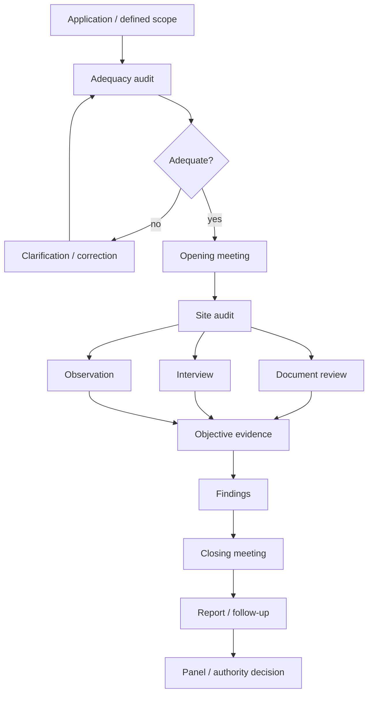
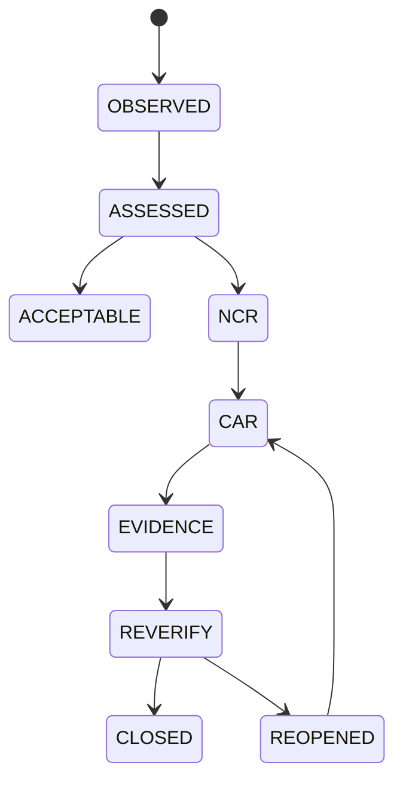
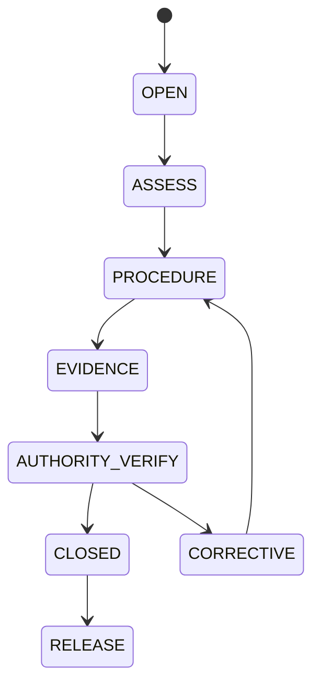
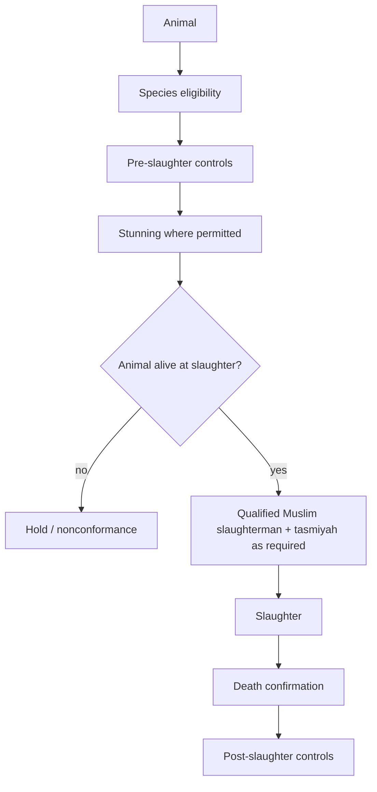

# 04 - CERTIFICATION, AUDIT, MPPHM/MHMS, SERTU AND STUNNING

## 1. Audit architecture from the supplied training material

The supplied `halal audit.pdf` distinguishes two major audit stages:

### Adequacy audit
A document/scope sufficiency gate before further application processing. The supplied material lists review of:

- company profile;
- factory location;
- product information;
- ingredient declaration;
- ingredient manufacturer/supplier identity;
- ingredient halal certificates and product specifications.

### Compliance audit
A conformity assessment of ingredient sources, production processes, halal contamination controls across the whole supply chain, hygiene and personnel against the applicable standard/procedure. It also checks whether the internal halal control/assurance system is implemented and monitored.

## 2. Compliance audit workflow



The training material emphasizes that auditors must visit locations where the relevant process actually occurs.

## 3. Audit competency

The supplied audit training separates Shariah competence from audit competence and also addresses relevant slaughtering knowledge. IQ300 should retain these as competency dimensions.

### Auditor object

`AuditorID, role, Shariah competence, technical competence, audit competence, slaughter competence where relevant, training history, recognition status, scope, renewal/expiry, assignments, conflict-of-interest declaration.`

## 4. Audit tool domains

The supplied audit material lists ten practical domains:

1. company profile;
2. raw ingredients;
3. employee;
4. premise cleanliness;
5. processing;
6. equipment and utensils;
7. packaging and labelling;
8. storage and handling;
9. transportation and distribution;
10. waste management.

IQ300 maps every domain to evidence, requirements and HCPs.

## 5. Evidence modes

`document + on-site inspection + interview + observation` should all be first-class audit evidence types.

## 6. NCR and corrective-action lifecycle



An NCR must be linked to the requirement, observed condition, affected scope, objective evidence, responsible owner, corrective action, due date, re-verification evidence and final disposition.

## 7. MPPHM / MHMS linkage in the supplied compendia

The supplied compendia connect certification operations to MPPHM 2020 and MHMS 2020 and describe scheme/size-dependent arrangements such as:

- Halal Supervisor / Halal Executive roles;
- Internal Halal Committee;
- Internal Halal Control System (IHCS) and Halal Assurance System (HAS) as applicable;
- document preparation;
- audit areas;
- panel/authority decision;
- certification mark permissions.

The supplied maximum-depth compendium describes an international-manufacturing route beginning 1 January 2024 with items including Malaysian-registered applicant, one manufacturing address, a minimum multi-day audit trip, HAS and a portal-described validity period. These are version-sensitive operational details and must be verified against the current official procedure before software hard-freeze.

## 8. Certification object

```text
CertificateID
Authority
Holder
RegisteredApplicant
ManufacturingSite
PremisesAddress
Scheme
ProductScope
ProductCategory
IssueDate
ExpiryDate
Status
AuthorityDecisionID
LogoPermissionStatus
SurveillanceStatus
SuspensionStatus
RevocationStatus
SourceInstrument
```

## 9. Certification boundary

`MS compliance != audit report != panel decision != certificate != consumer trust view.`

The platform may aggregate them, but it must never collapse them into one field.

---

# SERTU

## 10. Sertu classification

The supplied standards/compendia consistently distinguish sertu for najs al-mughallazah from ordinary cleaning. The described common method involves seven washes with mutlaq water, including one wash involving soil/approved soil-containing material. The precise authority requirements and materials must be version-controlled from the applicable official source.

## 11. Sertu event model



### Events

`E-SERTU-OPEN`, `E-SERTU-ASSESS`, `E-SERTU-PROCEDURE`, `E-SERTU-EVIDENCE`, `E-SERTU-CLOSE`, `E-AUTHORITY-VERIFY`, `E-ASSET-RELEASE`.

### Evidence

Affected object/location, trigger, responsible party, procedure record, water/material record, date/time, permitted supporting evidence, authority verification, release authorization.

### Boundary

PCR/qPCR or other analytical evidence does not substitute for a required Shariah sertu process.

---

# STUNNING / SLAUGHTER

## 12. Source boundary

The supplied compendia explicitly warn that MS 1500:2019 deleted the detailed slaughtering clause/annex and moved operational slaughter/stunning rules into the current Malaysian Protocol/JAKIM/fatwa/circular layer.

Therefore IQ300 should reference, not duplicate obsolete historical parameters.

## 13. Control concepts retained in the supplied materials

- permitted species;
- live animal at slaughter;
- Muslim slaughterman competence;
- tasmiyah as applicable;
- reversible stunning where permitted;
- no kill-before-slaughter condition;
- death attributable to the slaughter act rather than the stun;
- species-specific parameters;
- death confirmation as an HCP;
- monitoring and verification.



## 14. IQ300 rule

Every stunning/slaughter rule is stored with its operative source ID, version, effective date and authority jurisdiction. Numeric parameters are not copied forward from historical editions by default.

---

# CROSS-CUTTING FAILURE CONTROL

## 15. Common hold triggers

- certificate scope mismatch;
- expired or revoked credential;
- missing material provenance;
- unexplained contamination;
- failed or invalid laboratory controls;
- broken seal/custody exception;
- nonconforming transport/warehouse/retail condition;
- incomplete sertu evidence/verification;
- competency failure;
- unresolved NCR/CAR;
- change implemented without required approval/assessment.

## 16. Hold -> investigation -> authority-controlled release


