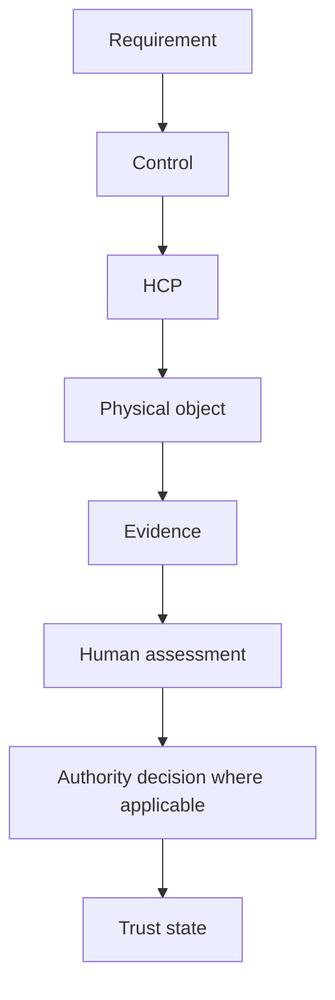
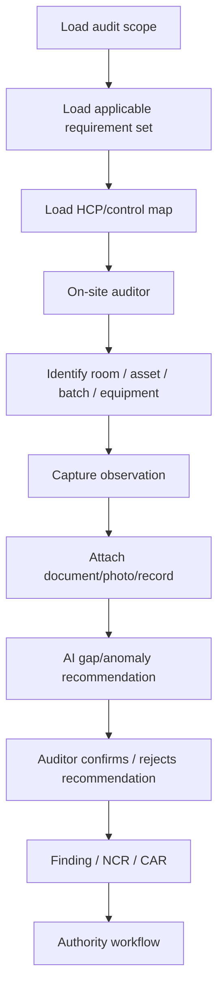
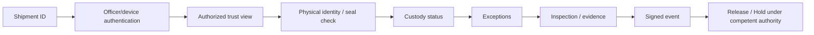
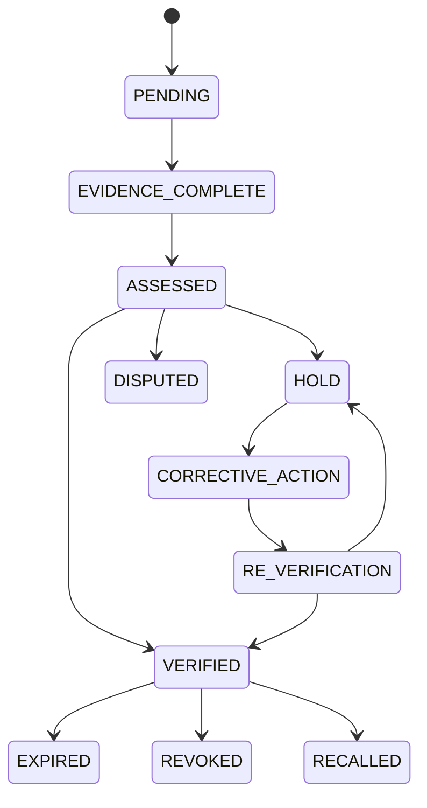

# 05 - IQ300 EVIDENCE FABRIC, DIGITAL AUDIT TWIN, TRUST GRAPH AND PROCESS FLOWS

## 1. Evidence Fabric

The standards stack becomes operational only when every requirement can be connected to a control and evidence. IQ300 therefore uses seven layers:

1. requirement;
2. control;
3. HCP;
4. physical object;
5. evidence;
6. assessment/authority decision;
7. trust state.

## 2. Digital Audit Twin

Each critical facility, product, batch/lot, pallet, container, vehicle, equipment item and sertu-affected asset can have a digital twin.

### Digital twin object

`DigitalTwinID, PhysicalObjectID, ObjectType, Owner, Custodian, CurrentLocation, CurrentStatus, LinkedRequirements, LinkedHCPs, LinkedCertificates, LinkedBatches/Lots, OpenIncidents, EvidenceIndex, AuthorityDecisionIndex, LastVerifiedAt, NextVerificationDue.`

## 3. Evidence object

`EvidenceID, EvidenceType, SourceSystem, SourceRecordID, PhysicalObjectID, BatchLot, RequirementID, ControlID, HCPID, Actor, Timestamp, Location, Method, DocumentVersion, IntegrityReference, ChainOfCustody, Validity, Interpretation, Reviewer, AuthorityRelevance, Supersedes.`

## 4. Authority decision object

`DecisionID, Authority, DecisionType, Scope, ObjectID, DecisionDate, EffectiveDate, ExpiryDate, Status, Conditions, SourceInstrument, SignedCredentialReference, RevocationStatus.`

## 5. Event taxonomy

The supplied compendia support event concepts including:

`E-SERTU-OPEN`, `E-SERTU-PROCEDURE`, `E-SERTU-EVIDENCE`, `E-SERTU-CLOSE`, `E-AUTHORITY-VERIFY`, `E-ASSET-RELEASE`, `E-STUN`, `E-SLAUGHTER`, `E-WH-IN`, `E-WH-OUT`, `E-CUSTODY-SEAL`, `E-AUDIT`, `E-SAMPLE`, `E-LAB-RESULT`, `E-PANEL`, `E-CERT-ISSUE`, `E-SURVEIL`.

Every event should carry object identity, actor, timestamp, location, source and integrity metadata.

## 6. Global Trust Graph

```mermaid
flowchart LR
    AUTH[Authority] --> INST[Standard / Protocol / Circular / Fatwa]
    INST --> REQ[Requirement]
    REQ --> CTRL[Control]
    CTRL --> HCP[HCP]
    HCP --> OBJ[Physical Object]
    OBJ --> EV[Evidence]
    EV --> AUD[Assessment]
    AUD --> FIND[Finding / NCR]
    FIND --> CAR[Corrective Action]
    CAR --> RV[Re-verification]
    RV --> DEC[Authority Decision]
    DEC --> STATE[Trust State]
    STATE --> REL[Release / Hold / Recall]
```

## 7. Smart-glass audit flow

The supplied audit training material emphasizes documents, on-site inspection, interviews and observations. IQ300 can turn this into a guided field workflow:

AI is advisory; the auditor/authority remains responsible for the assessment and decision.

## 8. Port / customs gateway

## 9. Shipment 001 graph

`China manufacturer -> material provenance -> audit/lab evidence -> authority/certification -> batch -> pallet/carton -> container/seal -> China logistics -> port/export -> transit -> GCC port/customs -> warehouse -> distribution -> retail -> consumer verification`.

## 10. Exception state machine

## 11. AI assurance modules

### Evidence Gap Predictor
Predicts missing evidence before an audit.

### Anomaly Engine
Flags abnormal custody, document, sensor or process patterns.

### Contradiction Engine
Compares supplier statements, certificates, lot identity, shipment identity and observed conditions.

### Trust Fracture Engine
Identifies the weakest broken link in the evidence graph.

### Predictive Compliance Engine
Prioritizes likely control failures and audit attention.

### Recall Blast-Radius Engine
Traverses the graph to identify all potentially affected lots, shipments, facilities and retail points.

## 12. AI governance rule

No AI output may:

- issue a halal certificate;
- change a competent-authority decision;
- infer halal status solely from a laboratory result;
- erase or rewrite audit history;
- override a live protocol, circular, fatwa or authority instruction.

## 13. Stakeholder views

- Manufacturer: material/source, production, batch and certificate scope.
- Auditor: requirements, evidence, HCPs, findings and corrective actions.
- Laboratory: sample identity, method, controls, result and chain of custody.
- Logistics: shipment, container, seal, custody and condition.
- Warehouse: inventory status, location, release/hold and movement.
- Retailer: product status, lot, display/handling controls and recalls.
- Port/customs: shipment identity, authorization, exceptions and release-relevant evidence.
- Consumer: public trust credential, scope, status, source authority and validity.

## 14. Privacy rule

The trust graph should expose the minimum information required by each stakeholder. Commercial formulations, employee information and confidential audit material should not become public merely because a product has a public trust credential.
