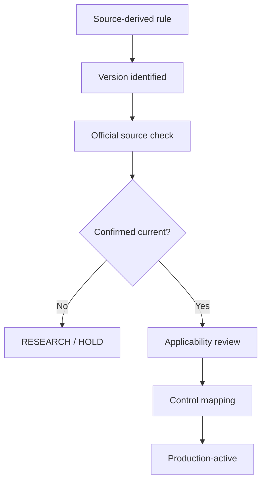

# 06 - SOURCE PROVENANCE, VERSION CONTROL AND VERIFICATION

## 1. Source register

| ID | Supplied source | Class | Use |
|---|---|---|---|
| S1 | `ms2400 1.pdf` | primary supplied standard | MS 2400-1 Transportation |
| S2 | `Ms2400 2.pdf` | primary supplied standard | MS 2400-2 Warehousing |
| S3 | `ms2400 3.pdf` | primary supplied standard | MS 2400-3 Retailing |
| S4 | `halal audit.pdf` | training/secondary | audit lifecycle, audit domains, competence |
| S5 | `halal.pdf` | training/secondary | halal fundamentals, awareness, compliance orientation |
| S6 | `JAKIM_MS_Halal_Standards_Compendium_Exhaustive_Reference.pdf` | secondary synthesis | standards catalogue and cross-cutting interpretation |
| S7 | `JAKIM_MS_Halal_Standards_MAXIMUM_DEPTH_Compendium.pdf` | secondary synthesis | expanded clause maps and IQ300 control synthesis |

## 2. Evidence confidence classes

- **A - Authority-confirmed:** checked against the current competent-authority instrument.
- **B - Primary supplied standard:** directly supported by a supplied standard PDF.
- **C - Supplied compendium:** supported by a supplied synthesized compendium.
- **D - Training material:** supported by supplied training slides.
- **E - IQ300 design:** an implementation architecture proposed by the project.

## 3. Version freeze

Every production requirement must store:

`Authority + instrument type + document number + edition + confirmation/status + effective date + superseded relationship + official source reference + acquisition date + hash/integrity reference + reviewer + verification date.`

## 4. Current-source verification gates

Before production hard-freeze, verify:

1. current status and confirmation of every Malaysian Standard from the official JSM/MySOL source;
2. current MPPHM and MHMS requirements;
3. current Malaysian Protocol / JAKIM documents for slaughter and stunning;
4. current sertu procedure and authority-supervision requirements;
5. official MS 2424 Annex B vaccine HCP table before implementing every row;
6. current international manufacturing certification procedure and portal rules;
7. current NPRA legal prerequisites for pharmaceutical/cosmetic applications;
8. current laboratory method edition, matrix applicability, kit/instrument/SOP details;
9. authority certificate status and revocation/suspension information.

## 5. Historic standard handling

Historical or replaced editions remain in the knowledge graph as superseded objects. They are not deleted and are not treated as active controls without explicit applicability.

## 6. Production rule promotion

## 7. Critical non-inference rules

- Negative PCR/qPCR does not automatically establish halal status.
- A certificate image does not establish live certificate status unless resolved to the authority credential.
- Product certification does not automatically certify every logistics node.
- Sertu cannot be inferred solely from laboratory evidence.
- Old slaughter/stunning values must not be carried into production simply because they appear in historic material.
- AI confidence is not a legal/certification decision.

## 8. Repository integrity

All source-derived claims should identify the exact source class. Any future correction must supersede an earlier claim rather than silently editing its historical meaning.
