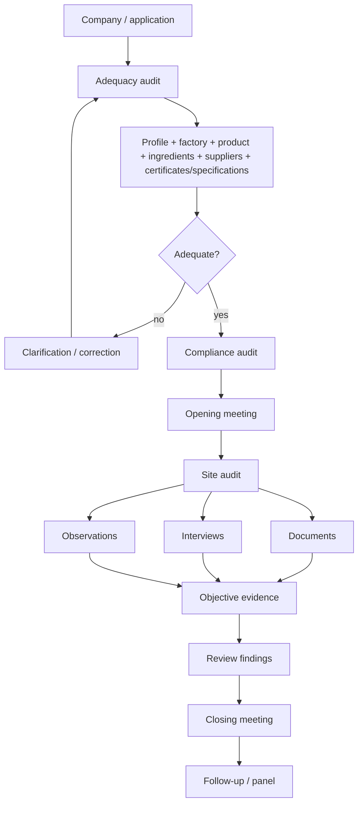

# 08 - HALAL AWARENESS + AUDIT TRAINING MAP

## 1. Source role

The supplied `halal.pdf` and `halal audit.pdf` are training materials, not replacements for normative standards. IQ300 uses them to capture foundational concepts, competency needs and practical audit execution.

## 2. Halal awareness topics represented

- meaning of halal and non-halal in Shariah/fatwa context;
- halal food conditions;
- halal slaughter concept;
- land and aquatic animal categories;
- najs awareness;
- sertu awareness;
- requirements for halal compliance;
- management/Halal Assurance System orientation;
- MS 1500:2019 awareness;
- Halal Control Point orientation;
- application, audit and approval/certification journey.

The awareness source presents halal food as satisfying multiple cumulative conditions around source, slaughter, najs, intoxicants, human-derived matter, safety, contaminated instruments and cross-contact with non-compliant food.

## 3. Compliance policy themes

The training source uses example objectives including formal management of a Halal Assurance System, MS 1500:2019 compliance, continuous improvement, continuous employee training/supervision, communication, certification of products for Islamic markets and verification of halal status of raw materials.

These are implementation/awareness themes and must be checked against the current official MHMS/MPPHM wording when converted into a certification rule.

## 4. Audit workflow

The supplied audit training distinguishes adequacy audit and compliance audit.

## 5. Audit domains

The supplied audit material lists:

`company profile; raw ingredients; employees; premise cleanliness; processing; equipment and utensils; packaging and labelling; storage and handling; transportation and distribution; waste management.`

## 6. Evidence modes

Every finding should be linked to one or more of:

- document;
- on-site inspection;
- interview;
- observation.

## 7. Human competency model

## 8. IQ300 implementation

Training attendance is not enough. The platform should bind:

`person -> role -> HCPs / process -> required competency -> training -> assessment -> authorization -> reassessment / renewal.`

## 9. Auditor decision boundary

Auditors gather and assess evidence within their role. Certification remains an authority process, and a panel/competent-authority decision must remain a distinct object in IQ300.
