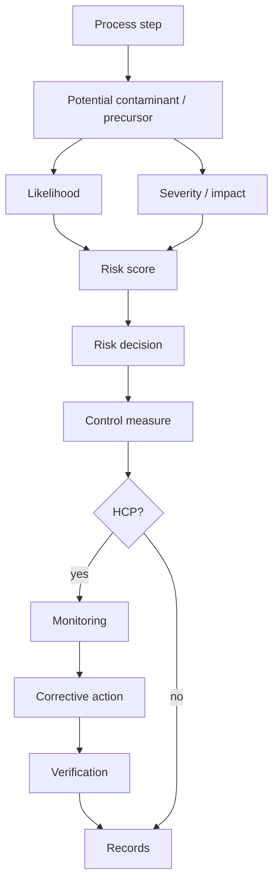
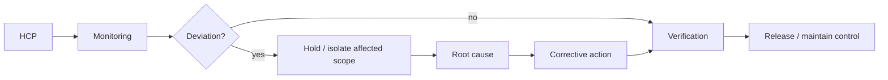

# 09 - MS 2400 ANNEX, RISK AND HCP DETAILS

## 1. Annex architecture common to the three supplied MS 2400 PDFs

### Annex A - Typical Halal Control Point Analysis worksheet

The HCP worksheet is the structured place to record the process step, potential contaminant/precursor, likelihood, severity/impact, risk ranking, control measure and related monitoring/verification logic. IQ300 should extend the worksheet with IDs for process, location, responsible person, evidence and exception state.

### Annex B - Likelihood / severity / risk ranking

The supplied standards use three likelihood levels:

- **Likely:** the halal status could be affected in most circumstances; common/repeated occurrence and may have happened several times.
- **Moderate:** the effect may occur sometimes; known to occur/have occurred before.
- **Unlikely:** the effect could occur only in exceptional circumstances; described as practically impossible in the source ranking language.

Three severity/impact levels are used:

- **Critical:** the potential contaminant can affect the total halal status and the status may not be salvageable; release can create major loss of customer/public/authority trust and significant business impact.
- **Moderate:** the halal status is affected but may still be salvageable; potential delivery/shipment delay and business/public-trust effects.
- **Insignificant:** no impact on halal status.

### Risk matrix in the supplied standards

| Likelihood | Insignificant | Moderate | Critical |
|---|---:|---:|---:|
| Likely | 4 - Moderate | 7 - Significant | 9 - High |
| Moderate | 2 - Low | 5 - Moderate | 8 - Significant |
| Unlikely | 1 - Low | 3 - Low | 6 - Moderate |

### Decision rules

The supplied Table B.4 uses risk score to determine the intensity of response:

- **9 / High:** detailed review and root-cause analysis; precautionary measures; scheduled monitoring/verification; staff briefing.
- **7-8 / Significant:** precautionary measures; scheduled monitoring/verification.
- **4-7:** follow the associated monitoring/verification controls according to the scheduled plan and risk interpretation.
- **1-3 / Low:** maintain the implemented control measures and continue routine monitoring/verification.

IQ300 must retain the exact source table/version and not silently replace it with a generic enterprise risk matrix.

## 2. Annex C - Halal Risk Management Summary

The supplied standards provide a summary worksheet concept for consolidating the risk-management plan. IQ300 fields should include:

`ProcessStep, PotentialContaminant, PotentialPrecursor, Likelihood, Severity, RiskScore, RiskCode, ControlMeasure, HCP, Monitoring, CorrectiveAction, Verification, Evidence, Owner, Date, Status.`

## 3. Retailing Annex D - typical retail process

The supplied MS 2400-3 PDF includes a retail process annex supporting the sequence around receiving, storage, preparation/handling, hot/cold processing where applicable, set-up/assembly/packaging, display/merchandising, sale/consumer-facing activities and downstream controls.

## 4. Sertu Annex D/E

The transportation and warehousing PDFs include a sertu method annex; the retailing PDF includes the sertu method in Annex E. The supplied compendia identify the shared method family as seven washes with mutlaq water including one wash using soil/approved soil-containing material.

The digital system should not hard-code every procedural detail from a secondary summary. It should store the operative source/version and the completed event evidence.

## 5. HCP analysis workflow



## 6. IQ300 enriched HCP object

```text
HCP_ID
StandardID
Clause
ProcessID
ProcessStep
PhysicalLocation
PhysicalObjectID
PotentialContaminant
PotentialPrecursor
Likelihood
Severity
RiskScore
RiskCode
ControlMeasure
ValidationReference
MonitoringParameter
MonitoringFrequency
ResponsiblePerson
DeviationThreshold
CorrectiveAction
VerificationMethod
Verifier
EvidenceIDs
AuthorityRelevance
CurrentStatus
```

## 7. HCP evidence rule

An HCP is operational only when there is evidence of implementation. A documented procedure without monitoring evidence is not equivalent to a controlled process state.

## 8. Control feedback loop


