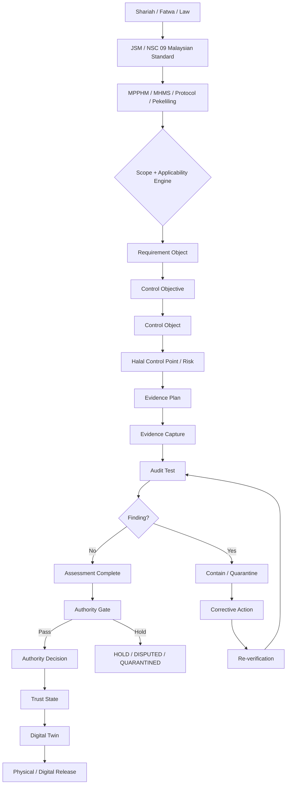
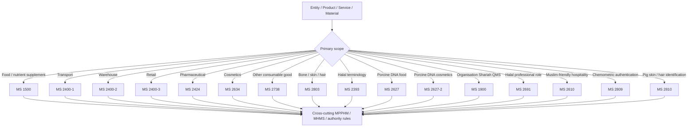
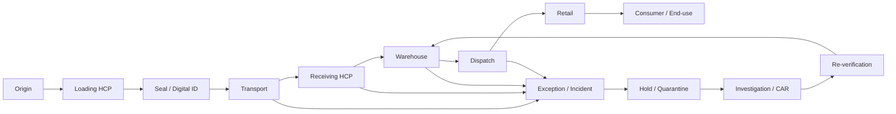
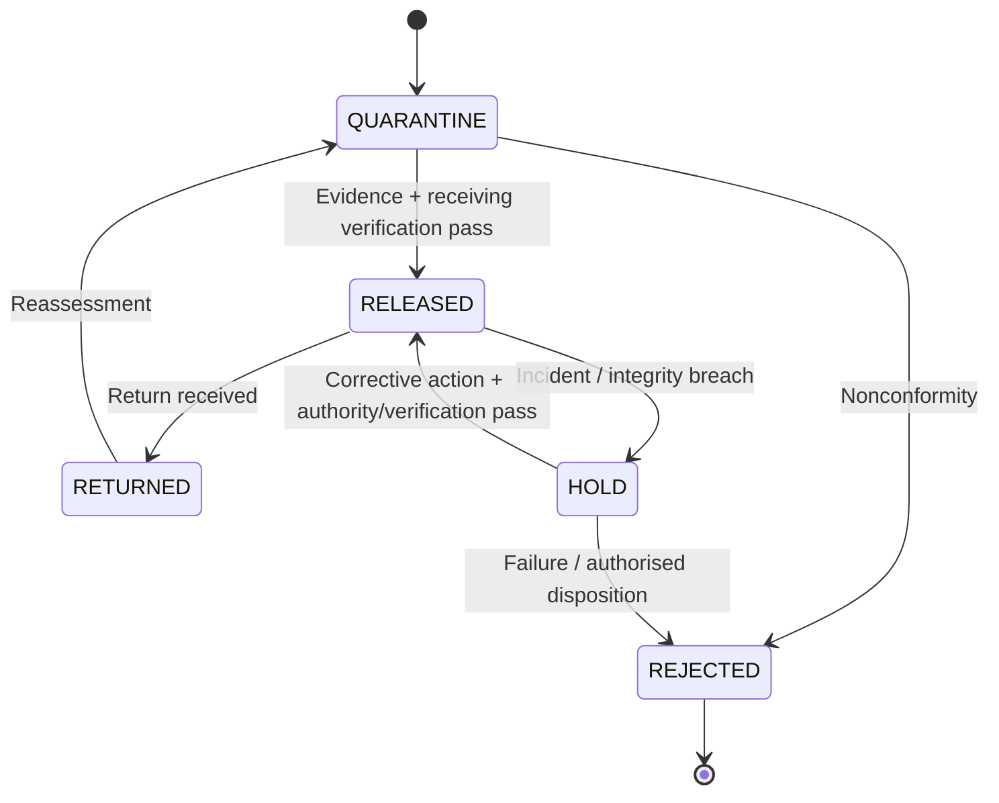
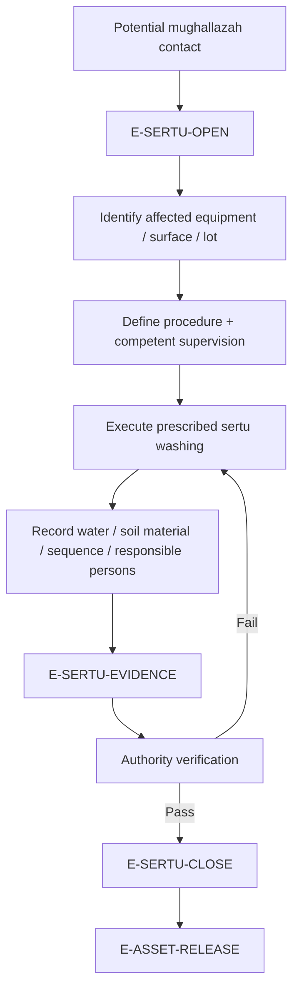
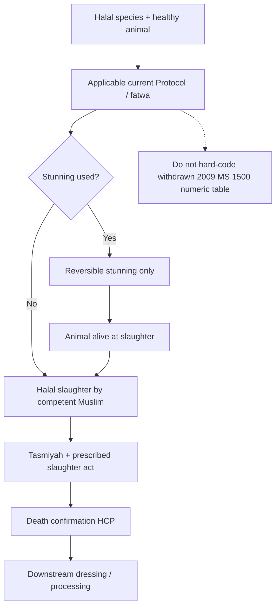
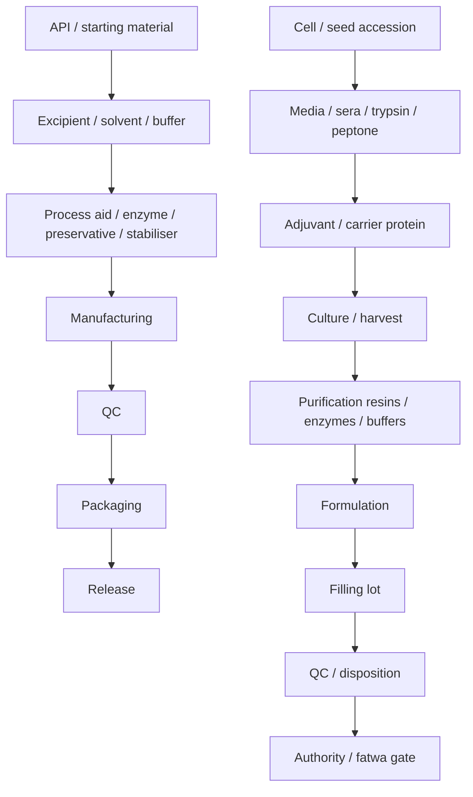
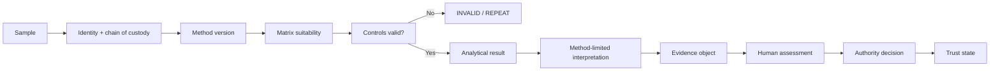
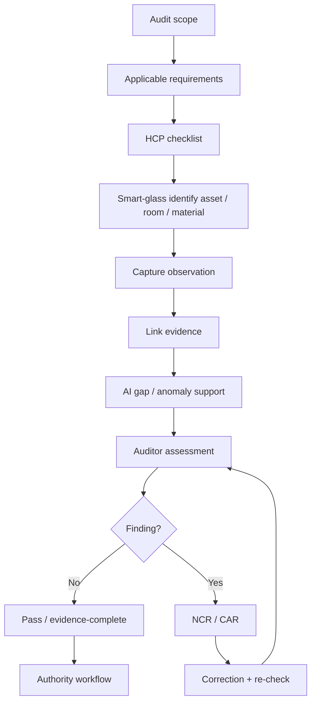
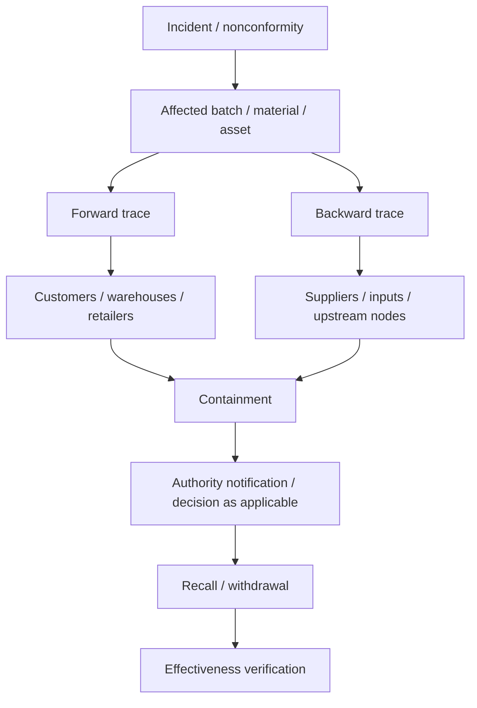

# IQ300 COMPLETE MERMAID PROCESS FLOWS

## A. Master regulatory-to-trust flow

## B. Standard selection router

## C. MS 2400 chain-of-custody flow

## D. Warehouse state machine

## E. Sertu lifecycle

## F. Slaughter / stunning boundary

## G. Pharmaceutical / vaccine HCP dependency graph

## H. Laboratory evidence boundary

## I. Smart-glass audit flow

## J. Recall blast-radius flow

