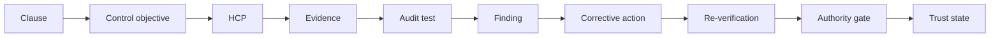
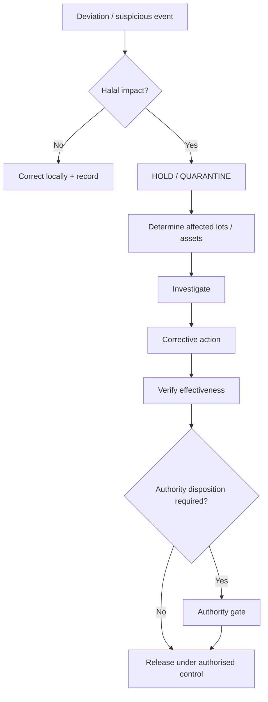
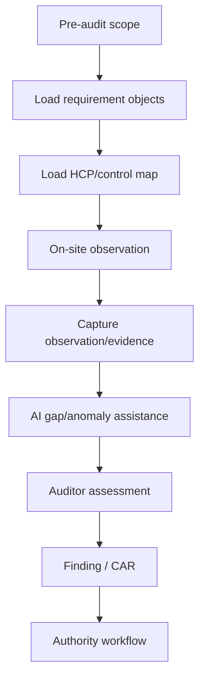
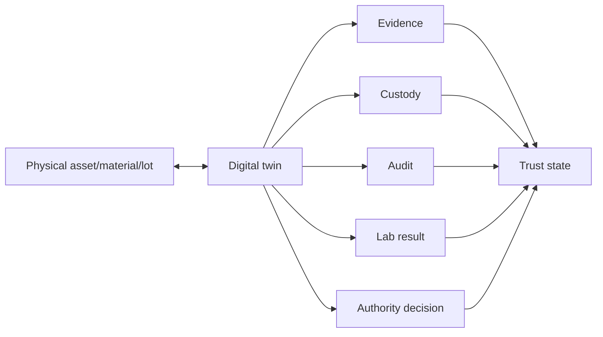

# IQ300 Process Flow Library

## 1. Clause-to-trust flow

```mermaid
flowchart LR
    C[Clause] --> O[Control objective]
    O --> H[HCP]
    H --> E[Evidence]
    E --> T[Audit test]
    T --> F[Finding]
    F --> CA[Corrective action]
    CA --> RV[Re-verification]
    RV --> AG[Authority gate]
    AG --> TS[Trust state]
```

## 2. MS 2400 operational flow

```mermaid
flowchart LR
    SUP[Supplier / origin] --> REC[Receiving / handover]
    REC --> Q[Identity + condition check]
    Q --> SEG[Segregation / status]
    SEG --> OPS[Controlled operation]
    OPS --> MON[Monitoring]
    MON --> VER[Verification]
    VER --> DISPATCH[Dispatch / transfer]
    DISPATCH --> CUST[Next custodian]
    CUST --> TRACE[Traceability graph]
```

## 3. Exception flow

```mermaid
flowchart TD
    X[Deviation / suspicious event] --> H{Halal impact?}
    H -- No --> CORR[Correct locally + record]
    H -- Yes --> HOLD[HOLD / QUARANTINE]
    HOLD --> SCOPE[Determine affected lots / assets]
    SCOPE --> INV[Investigate]
    INV --> CA[Corrective action]
    CA --> VER[Verify effectiveness]
    VER --> AUTH{Authority disposition required?}
    AUTH -- No --> REL[Release under authorised control]
    AUTH -- Yes --> GATE[Authority gate]
    GATE --> REL
```

## 4. Smart-glass audit

```mermaid
flowchart TD
    PRE[Pre-audit scope] --> REQ[Load requirement objects]
    REQ --> HCP[Load HCP/control map]
    HCP --> SITE[On-site observation]
    SITE --> CAP[Capture observation/evidence]
    CAP --> AI[AI gap/anomaly assistance]
    AI --> AUD[Auditor assessment]
    AUD --> FIND[Finding / CAR]
    FIND --> AUTH[Authority workflow]
```

## 5. Digital Audit Twin

```mermaid
flowchart LR
    ASSET[Physical asset/material/lot] <--> TWIN[Digital twin]
    TWIN --> E1[Evidence]
    TWIN --> E2[Custody]
    TWIN --> E3[Audit]
    TWIN --> E4[Lab result]
    TWIN --> E5[Authority decision]
    E1 --> TRUST[Trust state]
    E2 --> TRUST
    E3 --> TRUST
    E4 --> TRUST
    E5 --> TRUST
```
