# AHTE HD Visual Atlas

Control date: 2026-09-20  
Classification: post-freeze visual execution layer  
Authority effect: none  
Freeze boundary: does not rewrite `verified-2026-09-17/`

> AHTE is an evidence and decision-support platform. Official Halal certification and destination regulatory decisions remain with the competent authorities.

Existing vector set (already in this folder): `00` master atlas + `01`–`17` standard process-flow SVGs generated from `STANDARDS_FLOW_SPEC.json`.

This file adds the **end-to-end mermaid graphs** that the SVG generator does not yet cover: canonical path, standard router, custody, sertu, laboratory boundary, HITM plane, China→GCC pilot corridor, exception states, recall blast-radius, and smart-glass audit.

---

## 1. Canonical 14-node path

```mermaid
flowchart LR
    A[Authority] --> B[Standard / Instrument]
    B --> C[Clause / Requirement]
    C --> D[Applicability]
    D --> E[Control]
    E --> F[HCP / SCCP]
    F --> G[Evidence]
    G --> H[Audit Test]
    H --> I[Finding]
    I --> J[Corrective Action]
    J --> K[Re-verification]
    K --> L[Authority Gate]
    L --> M[Trust State]
    M --> N[Operational Release]
```

Trust State is internal. It is not an official certificate.

---

## 2. Master regulatory-to-trust flow

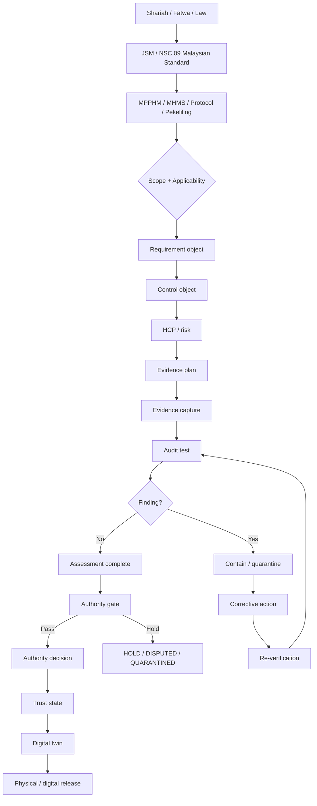

---

## 3. 17-standard selection router

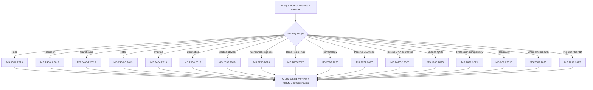

---

## 4. Evidence Fabric

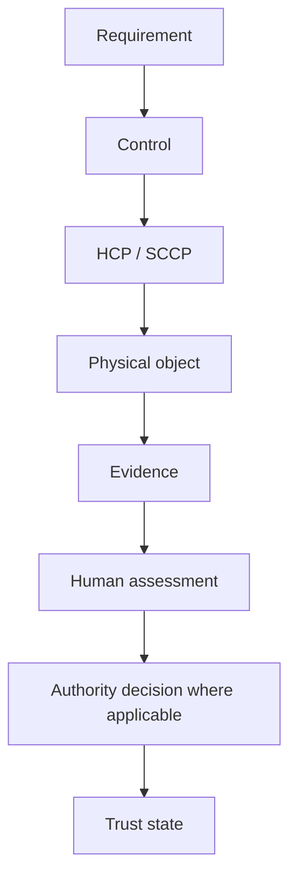

---

## 5. IQ300 assurance control plane (proposal)

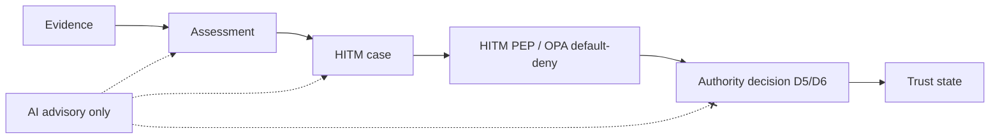

High AI confidence cannot skip D5/D6 authority gates. AI does not issue certificates.

---

## 6. MS 2400 chain of custody

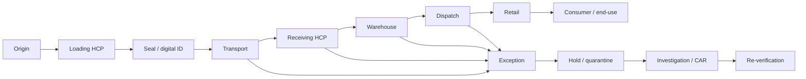

---

## 7. Sertu lifecycle

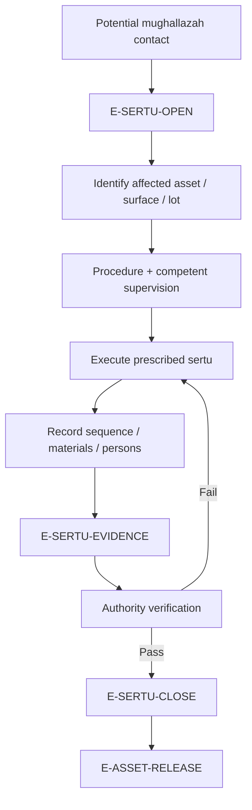

Generic sanitation does not substitute for sertu.

---

## 8. Laboratory evidence boundary

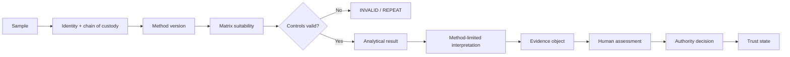

A `not detected` PCR/qPCR result does not by itself establish Halal status.

---

## 9. Smart-glass audit

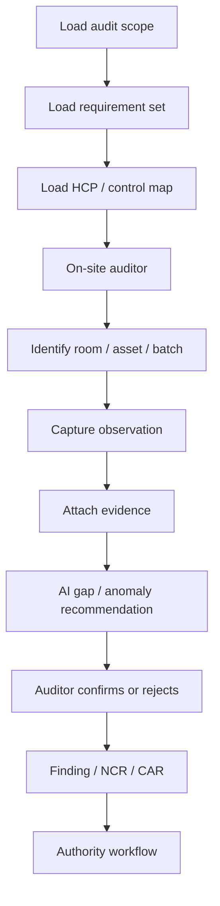

---

## 10. Port / customs gateway

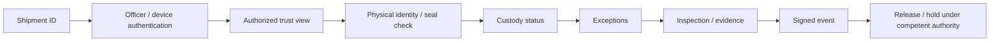

---

## 11. Shipment 001 corridor — PILOT architecture

`[PILOT: Shipment 001 — corridor model]`

Not instantiated until transaction-native evidence exists.

```mermaid
flowchart LR
    A[Legal entity] --> B[Factory]
    B --> C[SKU / formula]
    C --> D[Current certificate + issuer / scope / validity]
    D --> E[Destination recognition / rules]
    E --> F[Label / import registration]
    F --> G[Importer / buyer]
    G --> H[Commercial terms / PO]
    H --> I[Pilot batch]
    I --> J[Logistics qualification]
    J --> K[Container / seal]
    K --> L[Custody / telemetry]
    L --> M[Border release]
    M --> N[Receiving verification]
```

Five-segment physical model:

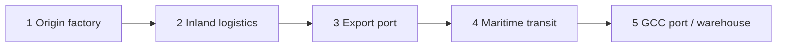

---

## 12. Exception / trust state machine

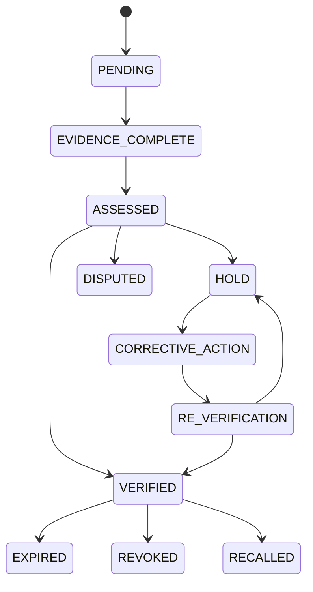

---

## 13. Recall blast-radius

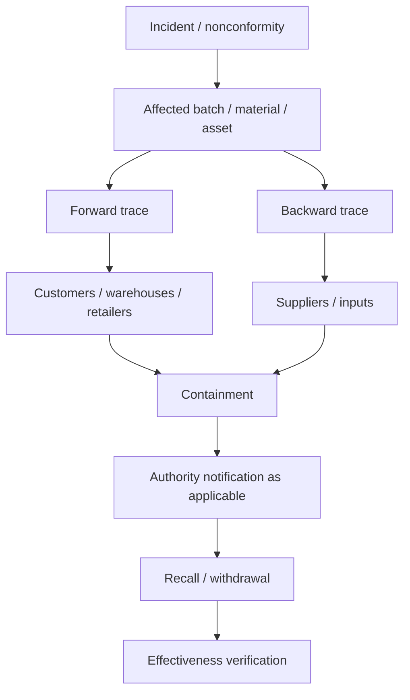

---

## 14. Warehouse states

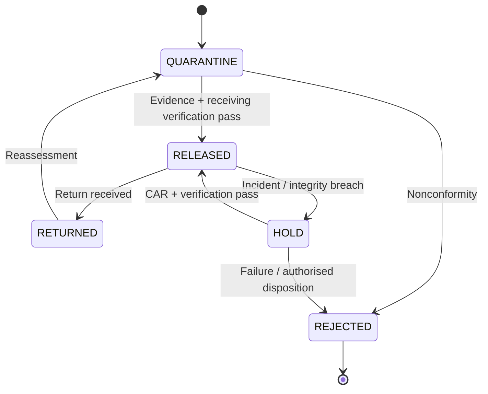

---

## Provenance

| Item | Source |
|---|---|
| Canonical path | README.md / IQ300 doctrine |
| 17-standard set | verified-2026-09-17 catalogue |
| Mermaid A–J | iq300-all-jakim-ms/03_COMPLETE_MERMAID_PROCESS_FLOWS.md |
| Evidence / twin / port | 05_IQ300_EVIDENCE_TRUST_PROCESS_FLOWS.md |
| HITM plane | IQ300_ASSURANCE_CONTROL_PLANE_SPEC_v0.1.md — proposal only |
| Shipment 001 | README China → GCC pilot — gated |

## Remaining gates

- Licensed MS normative wording: SOURCE-LOCKED (not drawn as clauses).
- MPPHM 2020 Pindaan 2026 primary text: OPEN GATE.
- Shipment 001 events / contracts / POs: TRANSACTION GATE.
- Raster HD frames generated in session remain local unless separately uploaded.
