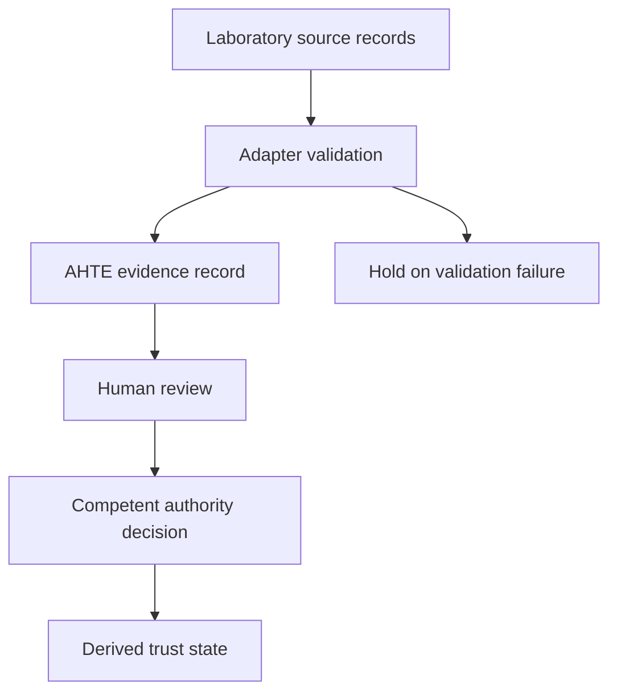

# China Food Safety Innovation Center — AHTE / JAKIM Laboratory Integration Profile

**Status:** `[PROPOSAL: closes laboratory integration gap — path point: Evidence → Authority Gate]`

**Control date:** 26 September 2026

**Repository base reviewed:** `499474aceff8590c9832044e2b4c70f9b39dab55` (2026-09-26)

**Important status rule:** This document defines the proposed integration architecture. It does **not** assert that JAKIM has already accredited, recognised, authorised, certified, endorsed, or directly connected the named Chinese organisation/laboratory. Those are external gates and require documentary evidence from the competent authority and the laboratory.

## 1. Purpose

Integrate the China Food Safety Innovation Center traceability / anti-counterfeit system and its laboratory evidence workflow into AHTE as a China-side sovereign evidence source.

The intended operating model is:

`China sample/product/material → laboratory test request → controlled sampling/chain of custody → method-controlled analysis → signed laboratory result/report → canonicalisation → SHA-256 evidence digest → signed evidence envelope → AHTE API → evidence validation → HITM/authority workflow → JAKIM authority gate where formally connected → trust-state update → authorised downstream verification`

The laboratory system is an **evidence producer**. AHTE is the **federated evidence/orchestration layer**. JAKIM remains the competent authority for any Malaysia Halal certification decision within its jurisdiction and scope.

## 2. Source verification and identity gate — revised 27 September 2026

This profile originated in draft PR #5 at `e6987e19dcd3de4566d7ca76f5ca4760654535ab`. Earlier prose asserted current institutional/accreditation/recognition facts without embedding source URLs or evidence references. Those assertions are not promoted here. The exact laboratory legal identity, current accreditation certificate and method/matrix schedule, authority acceptance and applicable interface specification remain source-locked. The NICFS platform, Hengqin project, Beijing academy and legacy laboratory placeholder must not be treated as aliases without documentary evidence.

Laboratory accreditation, foreign halal certification-body recognition, individual product certification and destination acceptance are separate objects. Verify each applicable object against its competent source; no historical recognition event proves the current status of this laboratory.

## 3. Authority boundary

The following are separate objects and must never be collapsed:

1. `LaboratoryIdentity`
2. `LaboratoryAccreditation`
3. `MethodScope`
4. `LaboratoryResult`
5. `EvidenceObject`
6. `HalalCertificationDecision`
7. `AuthorityDecision`
8. `TrustState`
9. `OperationalRelease`

A laboratory result can establish an analytical finding within the validated method scope. It does not independently establish Halal certification.

**Engine rule:** `NOT_DETECTED ≠ HALAL`.

A QR code, hash, blockchain anchor, AI assessment, sensor record or laboratory result is evidence/assurance infrastructure only. It cannot substitute for a competent-authority Halal decision.

## 4. Target operating architecture



All components describe a target integration; the authority adapter remains disabled until authorised and implemented.


## 5. Real-time decision model

"Real time" must be implemented as a controlled transaction/event flow, not as an assumption that a JAKIM production API already exists.

### State machine

`CREATED → SAMPLE_REGISTERED → IN_TRANSIT_TO_LAB → RECEIVED → TESTING → RESULT_DRAFT → TECHNICAL_REVIEW → REPORT_SIGNED → AHTE_RECEIVED → HASH_VERIFIED → EVIDENCE_ACCEPTED → AUTHORITY_REVIEW → AUTHORITY_DECISION → TRUST_STATE_UPDATED`

Exceptions:

`REJECTED_SAMPLE`, `CHAIN_OF_CUSTODY_BREAK`, `METHOD_OUT_OF_SCOPE`, `QC_FAILURE`, `RESULT_CORRECTION`, `REPORT_WITHDRAWN`, `SIGNATURE_INVALID`, `HASH_MISMATCH`, `AUTHORITY_HOLD`, `RE-TEST_REQUIRED`, `RECALL`.

### Target behaviours requiring implementation and verification

- API receipt acknowledgement.
- Schema validation result.
- Signature validation result.
- Hash-match result.
- Duplicate/replay detection.
- Object/batch/sample binding result.
- Evidence status transition.
- Authority-case correlation.
- Signed event timestamp.

### Guarantees that require JAKIM infrastructure/authorisation

- Receipt by an official JAKIM system.
- Official JAKIM case creation.
- Official JAKIM review status.
- Official JAKIM authority decision.
- Official SPHM/e-Cert issuance or status change.

These cannot be claimed until the official interface, authentication mechanism, service owner, endpoint, data contract and operational agreement are documented.

## 6. Conceptual laboratory evidence example

This illustration is not an executable API payload. The OpenAPI proposal is the field contract; its non-empty identifiers, object binding, method scope, custody and signature metadata are mandatory. The canonicalisation/signing byte profile remains an implementation gate, not an invented cryptographic standard.

```json
{
  "labEventId": "LAB-...",
  "sampleId": "SMP-...",
  "objectRefs": ["MATERIAL-...", "BATCH-...", "SKU-..."],
  "laboratory": {
    "legalEntityId": "...",
    "facilityId": "...",
    "accreditationBody": "CNAS|OTHER",
    "accreditationId": "...",
    "accreditationValidFrom": "...",
    "accreditationValidUntil": "...",
    "scopeReference": "..."
  },
  "method": {
    "methodId": "...",
    "methodVersion": "...",
    "methodSource": "...",
    "scopeStatus": "IN_SCOPE|OUT_OF_SCOPE"
  },
  "sample": {
    "matrix": "...",
    "collectedAt": "...",
    "receivedAt": "...",
    "condition": "...",
    "custodyRefs": ["..."],
    "sealId": "..."
  },
  "result": {
    "status": "...",
    "value": null,
    "unit": "...",
    "qualifier": "...",
    "uncertainty": "...",
    "interpretation": "..."
  },
  "report": {
    "reportId": "...",
    "reportVersion": "...",
    "issuedAt": "...",
    "reportHash": "sha256:..."
  },
  "integrity": {
    "canonicalisation": "AHTE-CANONICAL-JSON-V1",
    "contentHash": "sha256:...",
    "signatureAlgorithm": "Ed25519|approved-equivalent",
    "signature": "...",
    "keyId": "...",
    "previousEvidenceHash": "sha256:..."
  },
  "jurisdiction": "CN",
  "purpose": "HALAL_ANALYTICAL_EVIDENCE",
  "status": "SIGNED"
}
```

## 7. Tamper-proof / immutable evidence correction

The phrase "immutable hash" must be implemented precisely.

A SHA-256 hash is a content-integrity digest. It does not itself make the underlying database immutable.

AHTE should therefore use:

`Raw report → canonical serialisation → SHA-256 digest → signed evidence manifest → append-only event record → retention-controlled source reference → optional external ledger anchor`

The original report remains the source record. A corrected report creates a new version and a signed supersession/withdrawal event; the old evidence is not silently overwritten.

For high-value authority evidence, the storage layer should provide append-only/WORM controls or equivalent tamper-evident retention. A blockchain/DLT anchor is optional and must not become the authority root.

## 8. Sample chain of custody

The lab adapter must not accept a result as fully trustworthy merely because a report is signed.

Required chain:

`Sampling authorisation → sample ID → physical sample label → collection event → collector identity → seal → custody transfer → laboratory receipt → condition check → accession → aliquot/sub-sample relationship → method execution → QC → technical review → authorised signatory → report issuance → AHTE evidence receipt`

A broken or unexplained chain produces `CHAIN_OF_CUSTODY_BREAK` and routes the object to HOLD pending authorised review.

## 9. Method governance

Each test method must have a machine-readable scope record containing:

- method ID;
- method version/date;
- analyte/target;
- matrix;
- equipment requirements;
- calibration requirements;
- reference materials/controls;
- validation/verification status;
- detection/quantification characteristics where applicable;
- authorised laboratory scope;
- competent analyst/signatory role;
- applicable Malaysian standard/instrument reference;
- applicability decision;
- destination-market acceptance where relevant.

No generic statement such as `tested according to JAKIM Halal Standard` should be accepted as a substitute for the exact applicable analytical method and scope.

## 10. AHTE → JAKIM interface design

The integration must use an authority adapter rather than hard-code an unverified external endpoint.

### Submission

`POST /v1/authority-adapters/jakim/evidence` (internal proposal route; not an official JAKIM endpoint)

Payload:

- case/application ID;
- product/material/batch references;
- evidence IDs;
- report references;
- content hashes;
- signatures;
- accreditation/scope metadata;
- chain-of-custody summary;
- exceptions;
- source-system provenance;
- requested action.

### Response

```json
{
  "authorityReceiptId": "...",
  "caseId": "...",
  "receivedAt": "...",
  "status": "RECEIVED|UNDER_REVIEW|HOLD|DECIDED",
  "decisionRef": "...",
  "signature": "...",
  "verificationEndpoint": "..."
}
```

The actual endpoint, credentials, mutual-TLS profile, signing profile, request schema, response schema, rate limits, service-level agreement and authority status codes remain `SOURCE-LOCKED` until JAKIM supplies the controlling interface specification.

## 11. HITM integration

AI may:

- classify the evidence package;
- detect missing method/scope metadata;
- detect inconsistent sample/result relationships;
- compare the result against the applicable requirement set;
- identify contradictions;
- predict evidence gaps;
- route cases to the correct human officer.

AI may not:

- issue Halal certification;
- convert a laboratory `not detected` result into `Halal`;
- override JAKIM/JAIN authority decisions;
- change an authority decision;
- silently rewrite source evidence.

The controlling decision-class registry defines D0 ingest, D1 encoded control execution, D2 machine assessment, D3 finding/CAPA classification, D4 holds, D5 reserved authority gates and D6 sovereign/legal decisions. The reference implementation is not evidence of a deployed laboratory adapter.

## 12. China traceability platform integration

The supplied China anti-counterfeiting/traceability proposal provides a complementary physical/digital identity layer:

`microdot / QR / VOID label → product code → batch → packaging hierarchy → traceability record → scan/anomaly record`

AHTE should bind this identity to:

`material → sample → laboratory result → batch → production evidence → custody → shipment → authority decision`

The China platform's authenticity/traceability result is therefore a source event or evidence reference. It is not a Halal decision.

## 13. Required trust-packet linkage

The laboratory evidence should populate the existing AHTE trust packet through:

`TrustAssertionID → ObjectIDs → Issuer → Scope → Validity → Status → Batch/Lot → DecisionRefs → EvidenceHashes → LabIndicators → ExceptionFlags → VerificationEndpoint → Jurisdiction → Timestamp → Signature/TrustAnchor`

Detailed laboratory reports remain in the source-controlled laboratory domain unless a lawful, authorised disclosure requires transfer. AHTE should preferentially exchange hashes, signed assertions and minimum metadata.

## 14. Closure gates

| Gate | Required evidence | Owner | Status |
|---|---|---|---|
| L0 | Exact legal laboratory identity | Project + laboratory | OPEN |
| L1 | CNAS/competent accreditation certificate | Laboratory | OPEN |
| L2 | Accreditation schedule / method scope | Laboratory | OPEN |
| L3 | Method validation/verification records | Laboratory | OPEN |
| L4 | JAKIM audit/pre-assessment mandate | JAKIM / laboratory | OPEN |
| L5 | JAKIM recognition/approval instrument, if applicable | JAKIM | OPEN |
| L6 | Data-processing / cross-border legal basis | Parties / competent counsel | OPEN |
| L7 | API interface specification | JAKIM + AHTE | OPEN |
| L8 | Machine authentication / certificate exchange | JAKIM + AHTE | OPEN |
| L9 | Evidence signing/key-management policy | Laboratory + AHTE | OPEN |
| L10 | Report correction/withdrawal protocol | Laboratory + JAKIM + AHTE | OPEN |
| L11 | Production connectivity test | JAKIM + AHTE | OPEN |
| L12 | HITM workflow acceptance test | JAKIM / designated authority team | OPEN |
| L13 | Pilot sample/result dry run | Laboratory + AHTE | OPEN |
| L14 | Shipment 001 evidence-chain rehearsal | All applicable parties | OPEN |

## 15. Repository implementation impact

The existing repository already contains:

- a China laboratory partner placeholder with explicit open gates;
- a laboratory interoperability framework;
- laboratory identity/result/hash fields in the canonical data model;
- a China factory API contract with laboratory result objects;
- a cryptographic trust-anchor architecture;
- a China sovereign data architecture;
- a HITM/default-deny runtime that prevents laboratory evidence from becoming certification;
- a China Execution Pack for Shipment 001.

This profile therefore **extends the existing architecture** rather than creating a parallel trust model.

## 16. Source locks

`[SOURCE-LOCKED: JAKIM production API endpoint/authentication/schema — required: official JAKIM interface specification or executed integration agreement]`

`[SOURCE-LOCKED: JAKIM recognition/approval status of the exact Chinese laboratory — required: JAKIM written decision/instrument]`

`[SOURCE-LOCKED: exact Chinese laboratory legal identity and accreditation scope — required: legal entity record + current accreditation certificate/schedule]`

`[SOURCE-LOCKED: destination GCC acceptance of the laboratory evidence — required: destination authority/importer written acceptance where required]`

`[SOURCE-LOCKED: cross-border data-transfer mechanism for the exact datasets — required: China-side legal/data-governance determination and receiving-party basis]`

## 17. Canonical path mapping

`Authority → Standard/Instrument → Clause/Requirement → Applicability → Control → HCP/SCCP → Evidence → Audit Test → Finding → Corrective Action → Re-verification → Authority Gate → Trust State → Operational Release`

For this integration:

- **Authority:** JAKIM / applicable competent authority.
- **Standard/Instrument:** applicable current Malaysian Halal instruments and approved analytical methods.
- **Requirement:** exact test/evidence requirement for the product/material and case.
- **Applicability:** product, matrix, ingredient, risk and destination-specific applicability.
- **Control:** controlled sampling, testing, QC, review and evidence integrity.
- **HCP/SCCP:** applicable Halal control point or Shariah-critical control point.
- **Evidence:** signed laboratory result/report plus chain-of-custody and integrity metadata.
- **Audit Test:** authority/auditor verifies laboratory competence, method scope, sample identity, result integrity and source record.
- **Finding:** conformity/non-conformity/observation.
- **Corrective Action:** re-sampling, re-testing, CAPA, method review or process correction as applicable.
- **Re-verification:** authorised follow-up.
- **Authority Gate:** JAKIM/competent authority decision.
- **Trust State:** machine-readable evidence state derived from verified objects and authority decision.
- **Operational Release:** permitted operational action; never a substitute for certification.

## 18. Final integration position

The China system should be treated as a **China-side physical identity + traceability + laboratory evidence production plane** feeding AHTE.

AHTE should provide the **federated evidence, integrity, HITM, authority-gate, trust-state and cross-border verification plane**.

The integration preserves the intended AI-assists / human-decides operating model while allowing the laboratory and traceability infrastructure to operate at machine speed.
